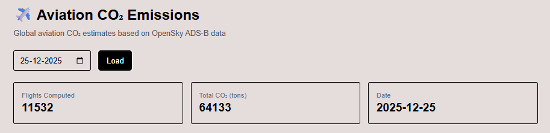
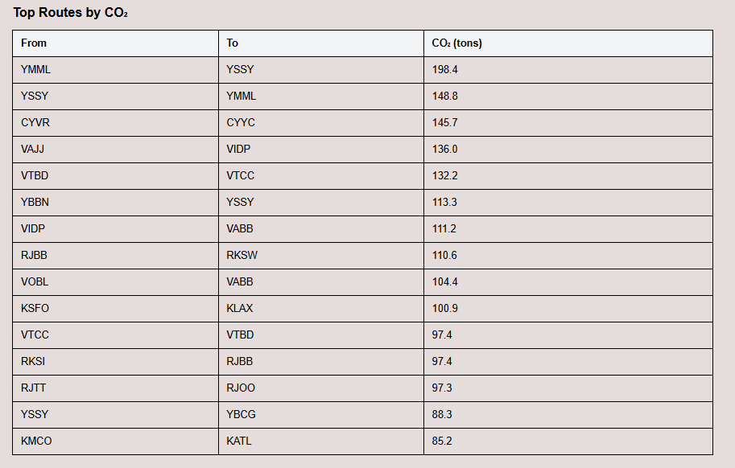
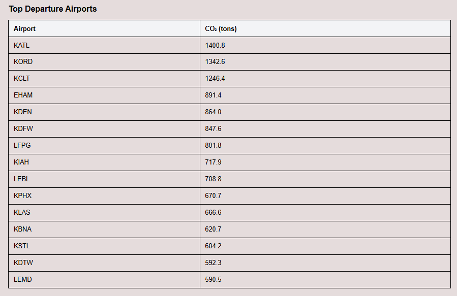
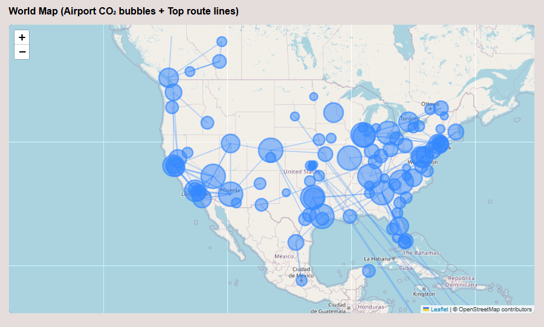
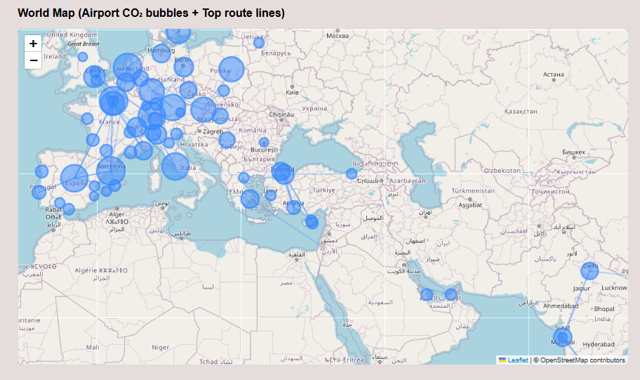

# ✈️ Aviation Emissions Analytics Web App

A full-stack web application that estimates and visualizes **global aviation CO₂ emissions** using real-world ADS-B flight data from the OpenSky Network.

This project transforms raw flight activity into actionable environmental insights, including total emissions, top routes, top airports, and interactive world maps.

---

## 🌍 Features

- Global aviation CO₂ estimation using real flight data
- Date-based analytics (daily snapshots)
- Top emitting routes and departure airports
- Interactive world map:
  - Airport CO₂ bubble visualization
  - High-emission route lines
- REST API backend + modern React frontend
- Built with open data and transparent assumptions

---

## 🧱 Tech Stack

### Backend
- **Python**
- **FastAPI**
- **Pandas / NumPy**
- **OpenSky Network API (OAuth)**
- **Parquet-based storage**

### Frontend
- **Next.js (App Router)**
- **React**
- **Tailwind CSS**
- **Leaflet / react-leaflet**

---

## 📊 Data Sources

- **Flight activity:** OpenSky Network (ADS-B data)
- **Airport metadata:** OurAirports (ICAO, lat/lon)
- **Emissions model:** Distance-based fuel burn estimation  
  - CO₂ conversion factor: `3.16 kg CO₂ / kg jet fuel`

> ⚠️ Emissions are **estimates**, not official airline-reported values.

---

## 🧮 Emissions Methodology (MVP)

1. Ingest global flights in 2-hour windows (OpenSky API constraint)
2. Extract departure and arrival airports
3. Map airports to latitude/longitude
4. Compute great-circle distance (Haversine)
5. Estimate fuel burn: `fuel_kg ≈ fixed_fuel + (fuel_per_km × distance_km)`
6. Convert to CO₂: `CO₂_kg = fuel_kg × 3.16`

Flights without reliable departure/arrival inference are excluded and reported as coverage loss.

---

## 🚀 Running Locally

### Backend
```bash
cd backend
pip install -r requirements.txt
python -m uvicorn app.main:app --reload --port 8000
```
### Frontend
```bash
cd frontend
npm install
npm run dev
```

### Visit:

- **Backend API**: http://127.0.0.1:8000
- **Frontend UI**: http://localhost:3000

## 🗺️ API Endpoints
- `/health` – API status

- `/co2/summary/{date}` – Daily CO₂ summary

- `/co2/map/{date}` – Map-ready airport & route emissions data

## 📥 Fetching Data for Additional Dates

Currently, the application only includes data for **December 25, 2025**. To add data for other dates:

### 1. Set up OpenSky API Credentials

You need OpenSky Network API credentials (OAuth client ID and secret):

1. Register at [OpenSky Network](https://opensky-network.org/) and create an OAuth application
2. Copy the template file and add your credentials:
   ```bash
   cp backend/credentials.json.example backend/credentials.json
   ```
   Then edit `backend/credentials.json` with your actual credentials:
   ```json
   {
     "client_id": "your-client-id",
     "client_secret": "your-client-secret"
   }
   ```

   > ⚠️ **Important**: `credentials.json` is in `.gitignore` and will not be committed to the repository.

   Alternatively, you can use environment variables or pass them directly to the client.

### 2. Ingest Flight Data

Fetch flight data for a specific date:
```bash
cd backend
source venv/bin/activate  # if using virtual environment
python scripts/ingest_day.py 2025-12-26
```

Or use the helper script to ingest and compute in one step:
```bash
# Single date
python scripts/ingest_and_compute.py 2025-12-26

# Date range
python scripts/ingest_and_compute.py 2025-12-26 2025-12-30
```

### 3. Compute Emissions

If you only ran ingestion, compute emissions separately:
```bash
python scripts/compute_co2_day.py 2025-12-26
```

**Note:** OpenSky Network provides historical data going back several years. However, data availability may vary by date. The API returns empty results for dates with no available data.

## 📸 Screenshots
KPI dashboard (total CO₂, flights)

Top routes and airports tables


World map with emission bubbles and route lines



## 🔮 Future Work
- Aircraft-type–specific fuel burn modeling

- Separation of cruise vs LTO (Landing & Take-Off) emissions

- NOx / non-CO₂ climate impact estimation

- Date range aggregation (weekly / monthly)

- SAF (Sustainable Aviation Fuel) scenario modeling

- Airline-level and country-level comparisons

- Performance optimizations with DuckDB / PostGIS

- Public deployment (Vercel + cloud backend)

- Data export (CSV / GeoJSON)

- Uncertainty bands and confidence scoring

## ⚖️ Disclaimer
This project is intended for educational, research, and exploratory analytics.
All emissions values are estimates based on publicly available data and simplified models.